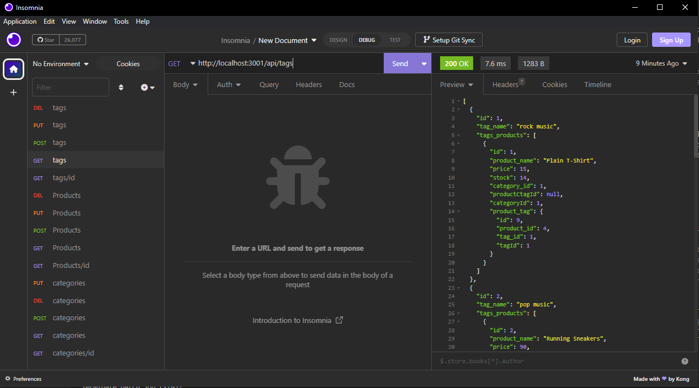

# 13 Object-Relational Mapping (ORM) Challenge

The challenge required students to modify starter code to create an application to provide a suite of services to businesses of all sizes by creating an E-commerce platform like Shopify. The task is to build the back end for an e-commerce site by confirguring a working Express.js api to use sequelize to interact with a MySql database.

The file consists of a config folder

Contents: JS, Node, express.js API sequalize and MySql database.

Please find attached an insomnia screenshot.

My GitHub: [RyanZade](https://github.com/RyanZade)
